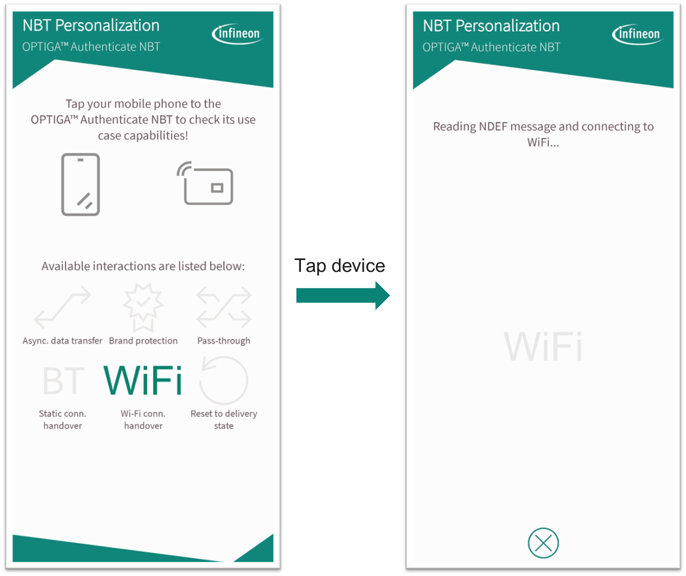
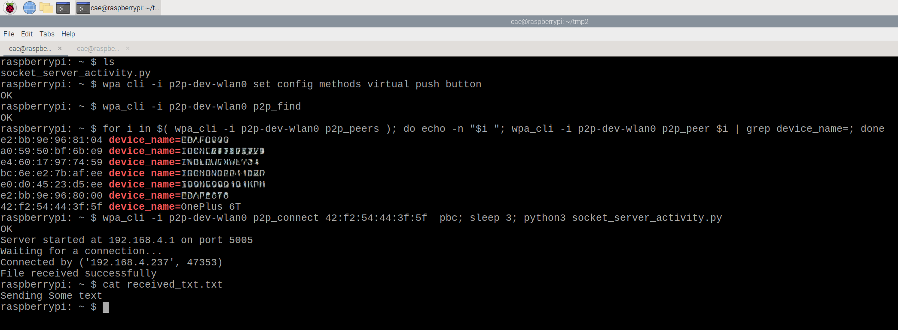
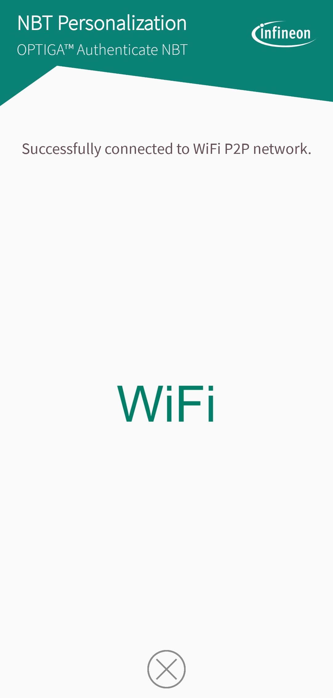

<!--
SPDX-FileCopyrightText: Copyright (c) 2024 Infineon Technologies AG
SPDX-License-Identifier: MIT
-->

# OPTIGA&trade; Authenticate NBT with Raspberry Pi - Sample project

[](CODE_OF_CONDUCT.md)
[](https://github.com/Infineon/optiga-nbt-lib-c/actions/workflows/linting-test.yml)
[](https://github.com/Infineon/optiga-nbt-lib-c/actions/workflows/cmake-single-platform.yml)

This is a sample project to implement WiFi static connection handover using OPTIGA&trade; Authenticate NBT interfaced with Raspberry Pi.

WiFi static connection handover is a technique used to establish a WiFi P2P (Peer-to-Peer) connection, also known as WiFi Direct, between two devices. This technology enables devices to connect to each other directly, without the need for a traditional WiFi access point.

## Hardware requirements

This section contains information on how to setup and interface the OPTIGA™ Authenticate NBT with Raspberry Pi.

- Raspberry Pi 4/5
- OPTIGA&trade; Authenticate NBT Development Shield

**Table 1. Mapping of the OPTIGA&trade; Authenticate NBT Development Shield's pins to Raspberry Pi**

| OPTIGA&trade; Authenticate NBT Development Shield | Raspberry Pi | Function |
| ------------------------------------------------- | --------------------- | -------- |
| SDA                           | GPIO 2        | I2C data                   |
| SCL                           | GPIO 3        | I2C clock                  |
| IRQ                           | NC        | Interrupt                  |
| 3V3                           | 3V3                     | Power and pad supply (3V3) |
| GND                           | GND                     | Common ground reference    |

The Raspberry Pi's pins need to be connected to the OPTIGA&trade; Authenticate NBT Development Shield as shown in Table 1.

### Modify confirguration file
To change the I2C speed and baudrate on a Raspberry Pi, you need to modify the `config.txt` file. The I2C interface on the Raspberry Pi can be configured to operate at different speeds by setting appropriate parameters in this file.
1. Open the `config.txt` file located in the `/boot` directory.
```sh
sudo nano /boot/config.txt
```
2. To set the I2C speed, you need to add or modify the dtparam entry for the I2C bus. The parameter `i2c_arm_baudrate` is used to set the baud rate for the ARM I2C interface.

Note: The I2C clock frequency cannot be changed dynamically in Raspberry Pi with i2c-dev driver. So setting the clock frequency using ```ifx_i2c_set_clock_frequency``` will not have any effect and returns success.
```sh
# Enable I2C interface
dtparam=i2c_arm=on

#Set I2C speed
dtparam=i2c_arm_baudrate=400000
```
3. After saving the confirguration file, reboot the system for changes to take effect.

### Toolset
`CMake`, `GCC` and `Make` tools are required for compiling and building software projects from source on Linux platform..

```sh
#Update the package list first
sudo apt-get update

#Install the toolset
sudo apt-get install cmake gcc make g++
```

## WiFi Direct setup in Raspberry Pi 
In a WiFi Direct network, devices are organized into groups, with each group having a designated Group Owner (GO). The Group Owner plays a crucial role in managing the network and one of its key responsibilities is to ensure that only one DHCP server is present in the group.

To achieve this, it's necessary to set the Raspberry Pi as the Group Owner in the WiFi Direct group and the below steps will take care of that:

Follow the steps in this link to configure wpa_supplicant and set the Raspberry Pi to become the Group Owner (GO).

Ensure you perform the following steps as mentioned in this [link](https://raspberrypi.stackexchange.com/questions/117238/connect-android-smartphone-with-wi-fi-direct-to-a-raspberry-pi#:~:text=Wi%2DFi%20Direct%20with%20a%20DHCP%20server%20on%20the%20Group%20Owner):

1. Follow the Quick Step
2. Create wpa_supplicant and enable it 
3. Create static IP address and enable the DHCP server.
4. Reboot the system for changes to be effective.


## Create NDEF message

The necessary information to establish a WiFi connection handover such as SSID and MAC address of the Raspberry Pi need to be stored in OPTIGA&trade; Authenticate NBT.

Create an NDEF message structure for Wi-Fi configuration using the [ndef library](https://ndeflib.readthedocs.io/en/latest/records/wifi.html#connection-handover) as provided in ```./scripts/create_NDEF_message.py```

Modify the ```mac_address``` to the MAC address of your Raspberry Pi and ```SSID``` to the device name set in ```wpa_supplicant-wlan0.conf```.

Run the script to generate the C array which is used in the following section.

## Write NDEF message to OPTIGA&trade; Authenticate NBT

Replace the data of ```WIFI_CONNECTION_HANDOVER_MESSAGE[]``` in the source/main.c file with the data generated in the previous section.

### CMake build system

To build this project, configure CMake and use `cmake --build` to perform the compilation.
Here are the detailed steps for compiling and installing as library:

```sh
# 1. Change to the directory where the project is located:
cd path/to/repository

# 2. Clone the gitmodules
git submodule init
git submodule update

# 3. Create a build folder in the root path 
mkdir build
cd build

# 4. Run CMake to configure the build system
cmake -S ..

# 5. Build the code
cmake --build .

# 6. The executable will be present in the build folder. Run the executable
./nbt-rpi
```

## Android application

Follow the steps provided in [optiga-nbt-example-perso-android](https://github.com/Pushyanth-Infineon/optiga-nbt-example-perso-android) for testing out the WiFi static handover. 

The mobile phone app needs to be installed on the mobile phone and for this, it is recommended to use Android Studio.


## Operational flow

1. Verify that both the hardware connections and software setup are properly established.

2. Set Raspberry Pi as the Group Owner in the WiFi Direct group.

3. Create an NDEF message and write it to OPTIGA&trade; Authenticate NBT.

4. The mobile phone app needs to be installed on the mobile phone. Launch the app and select the WiFi static handover application.

5. Tap the OPTIGA™ Authenticate NBT to the NFC antenna of the mobile phone. You will see the below images on your mobile phone:


<p align="center">
  
</p>

<p align="center">
  
</p>

6. Run the following commands on Raspberry Pi:
```sh
wpa_cli -i p2p-dev-wlan0 set config_methods virtual_push_button
wpa_cli -i p2p-dev-wlan0 p2p_find

#Copy the MAC address of the mobile phone and replace in the below command
wpa_cli -i p2p-dev-wlan0 p2p_connect de:a6:32:aa:45:ba pbc; sleep 3; python3 socket_server_activity.py
```




The last command will connect to the P2P device, wait for 3 seconds and establish socket connection to receive the data.

After executing the above commands, you will see the below screen on your phone after successfully connecting to WiFi P2P network.

<p align="center">
  
</p>

[./images/3NBT.png]: ./images/3NBT.png