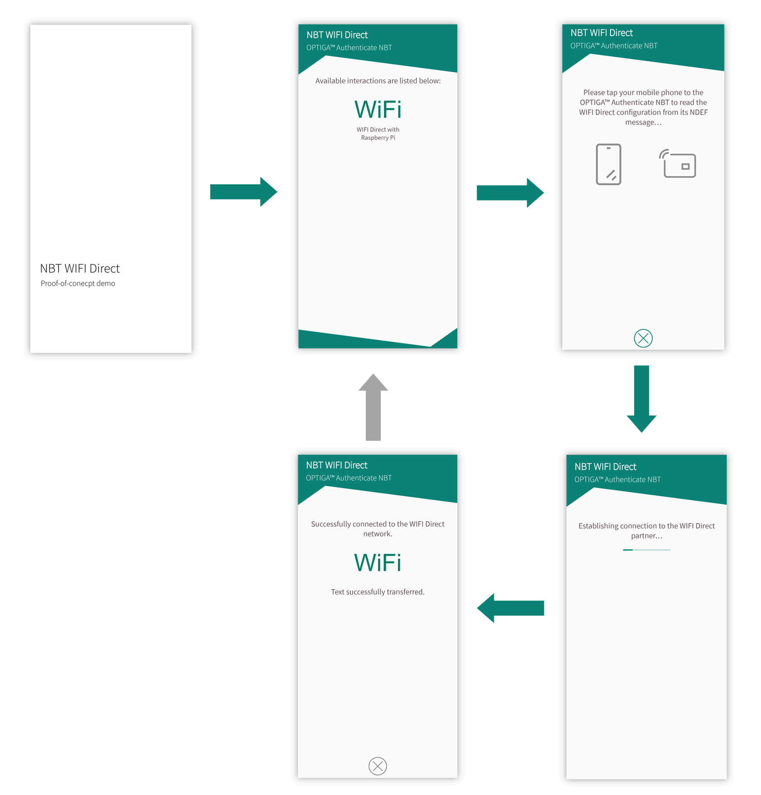
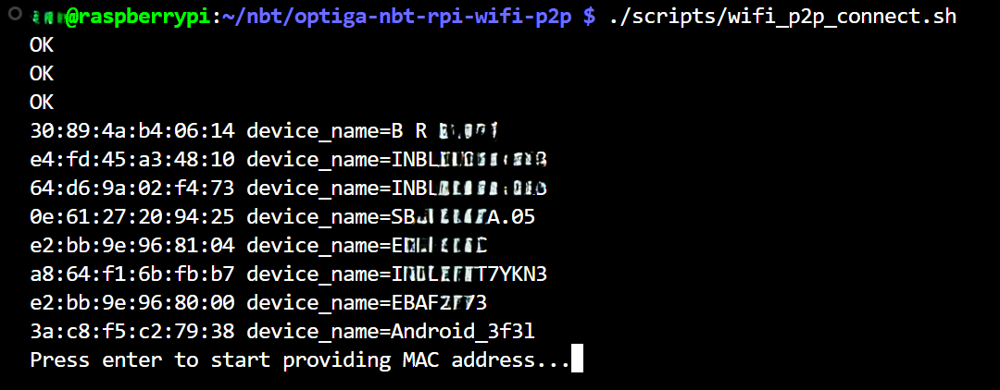
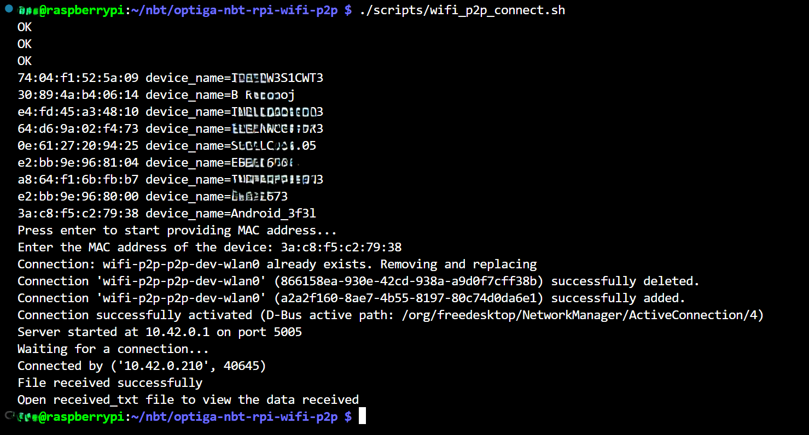

<!--
SPDX-FileCopyrightText: Copyright (c) 2024-2025 Infineon Technologies AG
SPDX-License-Identifier: MIT
-->

# OPTIGA™ Authenticate NBT WIFI Direct Demo Application for Raspberry Pi

This repository contains a set of scripts and applications for Raspberry Pis to demonstrate the establishment of a WIFI Direct connection using the OPTIGA&trade; Authenticate NBT.

## Overview

WiFi static connection handover is a technique used to establish a WiFi P2P (Peer-to-Peer) connection, also known as WiFi Direct, between two devices. This technology enables devices to connect to each other directly, without the need for a traditional WiFi access point.

This project is intended to be used in combination with
the [WIFI Direct Demo App for Android](https://github.com/Pushyanth-Infineon/optiga-nbt-example-perso-android)
to demonstrate the OPTIGA™ Authenticate NBT's WIFI Direct functionality.

## Getting started

Information on how to prepare and use the Raspberry Pi for the WIFI Direct demo.

### Requirements

This section contains information on how to setup and interface the OPTIGA™ Authenticate NBT with Raspberry Pi.

- Raspberry Pi 4/5
- [OPTIGA&trade; Authenticate NBT Development Shield](https://www.infineon.com/cms/en/product/evaluation-boards/optiga-auth-nbt-shield/)

The following table shows the mapping of the OPTIGA&trade; Authenticate NBT Development Shield's pins to Raspberry Pi.

| OPTIGA&trade; Authenticate NBT Development Shield | Raspberry Pi |          Function          |
| ------------------------------------------------- | ------------ | -------------------------- |
| SDA                                               | GPIO 2       | I2C data                   |
| SCL                                               | GPIO 3       | I2C clock                  |
| IRQ                                               | NC           | Interrupt                  |
| 3V3                                               | 3V3          | Power and pad supply (3V3) |
| GND                                               | GND          | Common ground reference    |

The Raspberry Pi's pins need to be connected to the OPTIGA&trade; Authenticate NBT Development Shield as shown in Table 1.


Since the pins of the Shield are compatible with the Raspberry Pi's GPIO pinout, the shield may also be directly attached to the Raspberry Pi as seen in the image above.

### Setup

Setup steps to get the WIFI Direct information into the OPTIGA™ Authenticate NBT's NDEF message.
After this, every device can use this record to initiate a WIFI Direct connection with the Raspberry Pi. 

#### Modify configuration file

To change the I2C speed and baudrate on a Raspberry Pi, you need to modify the `config.txt` file. The I2C interface on the Raspberry Pi can be configured to operate at different speeds by setting appropriate parameters in this file.

1. Open the `config.txt` file located in the `/boot/firmware` directory for Raspberry Pi 5.

    ```sh
    sudo nano /boot/firmware/config.txt
    ```

2. To set the I2C speed, you need to add or modify the dtparam entry for the I2C bus. The parameter `i2c_arm_baudrate` is used to set the baud rate for the ARM I2C interface.

    Note: The I2C clock frequency cannot be changed dynamically in Raspberry Pi with i2c-dev driver. So setting the clock frequency using ```ifx_i2c_set_clock_frequency``` will not have any effect and returns success.

    ```sh
    # Enable I2C interface
    dtparam=i2c_arm=on

    #Set I2C speed
    dtparam=i2c_arm_baudrate=400000
    ```

3. After saving the configuration file, reboot the system for changes to take effect.

#### Toolset

`CMake`, `GCC` and `Make` tools are required for compiling and building software projects from source on Linux platform..

```sh
#Update the package list first
sudo apt-get update

#Install the toolset
sudo apt-get install cmake gcc make g++
```

#### WiFi Direct setup in Raspberry Pi

In a WiFi Direct network, devices are organized into groups, with each group having a designated Group Owner (GO). The Group Owner plays a crucial role in managing the network and one of its key responsibilities is to ensure that only one DHCP server is present in the group.

To achieve this, it's necessary to set the Raspberry Pi as the Group Owner in the WiFi Direct group and the below script take care of that.

The script uses NetworkManager which is available by default in Raspberry Pi (Bookworm - Debian 12).

Run the script:

```bash
  ./scripts/wifi_p2p_setup.sh
```

#### Create NDEF message

The necessary information to establish a WiFi connection handover such as SSID and MAC address of the Raspberry Pi need to be stored in OPTIGA&trade; Authenticate NBT.

Install ndeflib package for creating an NDEF message structure in python

```bash
  pip install ndeflib --break-system-packages
```

Create an NDEF message structure for Wi-Fi configuration using the [ndef library](https://ndeflib.readthedocs.io/en/latest/records/wifi.html#connection-handover) as provided in

```bash
  python3 ./scripts/create_NDEF_message.py
```

#### Write NDEF message to OPTIGA&trade; Authenticate NBT

The above script automatically updates the data of ```WIFI_CONNECTION_HANDOVER_MESSAGE[]``` in the source/main.c file.

#### CMake build system

To build this project, configure CMake and use `cmake --build` to perform the compilation.
Here are the detailed steps for compiling and installing as library:

```sh
# 1. Change to the directory where the project is located:
cd path/to/repository

# 2. Clone the gitmodules
git submodule init
git submodule update

# 3. Create a build folder in the root path 
mkdir build
cd build

# 4. Run CMake to configure the build system
cmake -S ..

# 5. Build the code
cmake --build .

# 6. The executable will be present in the build folder. Run the executable
./nbt-rpi
```

### Usage

The following command can be used to run the WIFI direct script on the Raspberry Pi (intended to be used together with the [WIFI Direct Demo App for Android](https://github.com/Pushyanth-Infineon/optiga-nbt-example-perso-android)).

  ```bash
  ./scripts/wifi_p2p_connect.sh
  ```

It seeks for potential WIFI Direct peers, and asks the user to enter the desired peer's MAC address.
It then attempts to connect to that peer and tries to receive test data from the client.

To revert the WIFI Direct setup on the Raspberry Pi, the following command can be used:

```bash
  ./scripts/wifi_p2p_revert_changes.sh
```

After this step, the setup steps need to be re-executed in order to setup the Raspberry Pi for the demo.

## Operation of the WIFI Direct demo

Instructions on how to run the full WIFI Direct demo.

### Android application

To run the full demo, also an Android mobile phone with the [WIFI Direct Demo App for Android](https://github.com/Pushyanth-Infineon/optiga-nbt-example-perso-android) is also needed.
Follow the setup instructions in that project in order to build and install the app to the mobile phone.



### Operational flow

1. Verify that both the hardware connections and software setup are properly established.

2. Make sure the Raspberry Pi's WIFI Direct setup has been completed (see [Getting started](#getting-started)).

3. Make sure the NDEF message has been created and written to the OPTIGA&trade; Authenticate NBT (see [Getting started](#getting-started)).

4. Turn on WIFI before launching the mobile phone app and select the *WIFI Direct with Raspberry PI* interaction.

5. In the next screen, tap the mobile phone to the OPTIGA™ Authenticate NBT shield's NFC antenna.
   The app changes to a new screen and starts to establish the WIFI Direct connection.
   *P2P is enabled* and *Discovery initiated* shall pop up on that screen.  

6. Run the following script on the Raspberry Pi to search and connect to your mobile phone:

    ```bash
    ./scripts/wifi_p2p_connect.sh
    ```

    

    Enter the MAC address of Android device:

    

    The last command will connect to the P2P device, wait for 3 seconds and establish socket connection to receive the data.
    After executing the above script, you will see the below screen on your phone after successfully connecting to WiFi P2P network.

## Additional information

### Related resources

- [OPTIGA™ Authenticate NBT: Product page](https://www.infineon.com/OPTIGA-Authenticate-NBT)
- [OPTIGA™ Authenticate NBT: GitHub overview](https://github.com/Infineon/optiga-nbt)
- [OPTIGA™ Authenticate NBT: WIFI Direct Demo App for Android](https://github.com/Pushyanth-Infineon/optiga-nbt-example-perso-android)

### Contributing

Contributions are very welcome and can be made via GitHub Pull requests.
However, there is no guarantee that your pull request is addressed or even answered.

### Contact

In case of questions regarding this repository and its contents, refer to the owners of this repo.

### Licensing

This project follows the [REUSE](https://reuse.software/) approach, so copyright and licensing
information is available for every file (including third party components) either in the file
header, an individual *.license file or the [REUSE.toml](REUSE.toml) file. All licenses can be found in the
[LICENSES](LICENSES) folder.

### Release

- v1.0.0 - Initial release for wifi p2p.
- v2.0.0 - Added automation scripts. Now the setup uses NetworkManager instead of systemd-networkd.
